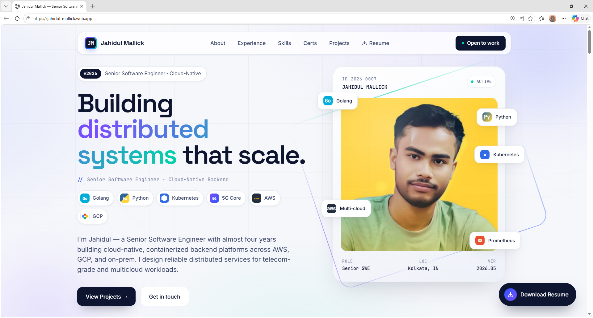
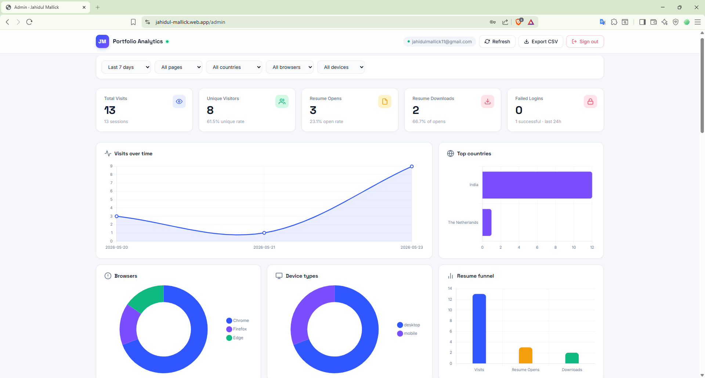
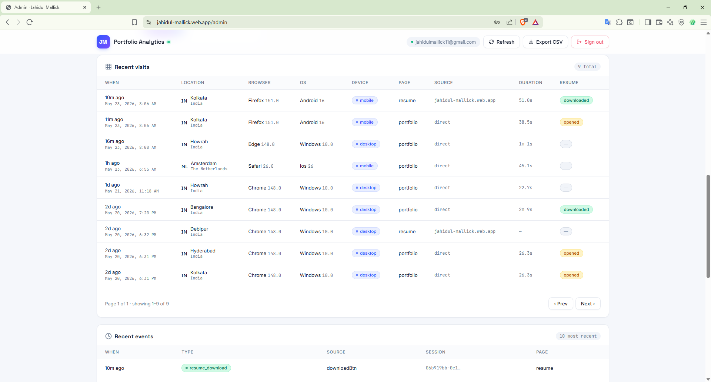
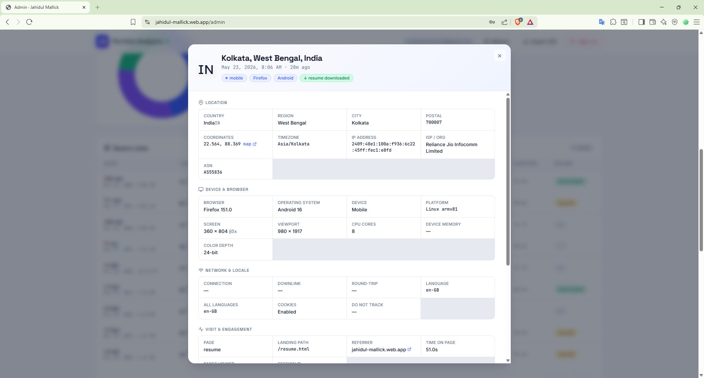

<div align="center">

# 🌐 Live Portfolio → [**jahidul-mallick.web.app**](https://jahidul-mallick.web.app)

### Open the link above to view the live site directly in your browser

<br/>

```
╔══════════════════════════════════════════════════════════╗
║                                                          ║
║          J A H I D U L   ·   M A L L I C K               ║
║                                                          ║
║              Senior Software Engineer Portfolio          ║
║       Cloud-Native · Distributed Systems · Backend       ║
║                                                          ║
╚══════════════════════════════════════════════════════════╝
```

### `v2026` · A portfolio that tracks its own visitors

[](https://jahidul-mallick.web.app)
[](https://jahidul-mallick.web.app/resume.html)
[](https://www.linkedin.com/in/jahidul-mallick/)

<br/>


</div>

---

## 📖 Overview

Welcome to my personal portfolio — a **production-grade single-page portfolio site** backed by a **real-time visitor analytics platform** and a **password-protected admin dashboard**.

This isn't just a static résumé page. Every visitor is silently captured (no permission prompts, GDPR-conscious) and persisted to **Cloud Firestore**. A separate, locked-down admin route surfaces the data with summary cards, six interactive charts, filterable tables, login-attempt monitoring, and a card-based visitor detail view.

> **TL;DR** — A vanilla-JS portfolio shipped to Firebase Hosting, with a fully functional analytics engine and admin panel deployed alongside it. Zero build tooling beyond `terser` for minification. Lightweight, lazy-loaded, and silently never blocks a visitor's first paint.

📦 **What's in this repo?** This is the **public showcase repo** — it hosts the screenshots and documentation for visitors browsing my GitHub profile. The actual portfolio source code lives in a private repository.

---

## 📸 Preview

### 🌐 Public Portfolio (`/`)
> The landing page. Hero, technology pills, experience timeline, skills, certifications, projects, and contact — all on a single scrollable canvas with smooth-reveal animations.



<br/>

### 📊 Admin Analytics Dashboard (`/admin`)
> Live summary cards, **6 interactive charts**, and date/page/country/browser/device filters. Built with a modern light UI and a soft shadow language for clarity.



<br/>

### 👥 Recent Visits Panel
> Every captured visit with location flags, browser + OS + device, page hit, source/referrer, time-on-page, and resume engagement status. Paginated, sortable, and instantly searchable through the top filter bar.



<br/>

### 🪪 Visitor Detail View
> Click any visit row → a **card-based, human-friendly detail modal** opens. No raw JSON walls — the data is grouped into Location, Device & Browser, Network & Locale, Visit & Engagement, Campaign attribution (if any), Resume actions, and the full user-agent. Collapsible raw view at the bottom for debugging.



---

## ✨ Features

### 🌐 Public Portfolio Site

- 🎨 **Modern, animated UI** — gradient backgrounds, floating orbs, scroll-reveal sections, polished typography (`Inter` + `Space Grotesk` + `JetBrains Mono`)
- 🧠 **Dynamic experience calculation** — years-of-experience auto-updates from a fixed start date; no annual edits required
- 📄 **Inline resume page** — `/resume.html` with print-friendly styling and a one-click "Download PDF" button
- 📱 **Fully responsive** — mobile-first grid layouts, touch-friendly tap targets
- ⚡ **Sub-second first paint** — vanilla HTML/CSS, inline critical CSS, no framework runtime
- 🔗 **Direct social links** — GitHub, LinkedIn, email, all one click away

### 🔒 Admin Dashboard (`/admin`)

- 🔐 **Firebase Authentication** (Email + Password) — only the admin can read visitor data
- 🛡️ **Login attempt monitoring** — every sign-in attempt (success **and** failure) is logged with email tried, error reason, IP, country, ISP, user agent
- 📈 **Live summary cards** — Total Visits · Unique Visitors · Resume Opens · Resume Downloads · Failed Logins (24h)
- 📊 **Six interactive charts** (Chart.js, lazy-loaded after login):
  1. Visits over time (line, gradient fill)
  2. Top countries (horizontal bar)
  3. Browsers (doughnut)
  4. Device types (doughnut)
  5. Resume funnel (visits → opens → downloads)
  6. Operating systems (doughnut)
- 🔍 **Five-axis filters** — date range · page · country · browser · device
- 📋 **Paginated visits table** (50/page) — click any row for the rich detail modal
- 🎯 **Recent events panel** — every resume open/download tracked as a discrete event
- 📥 **CSV export** — one click to download the current filtered slice
- 🌗 **Modern light UI** — clean surfaces, soft shadows, country flag emojis, frosted-glass topbar

### 🛰️ Visitor Tracking (Silent & Private-Friendly)

Every visit captures (no permission prompts required):

| Category | Data Points |
|---|---|
| **Geo (IP-based)** | Country · Region · City · Postal · Lat/Lon · Timezone · ISP/Org · ASN |
| **Device** | Type (desktop/mobile/tablet) · Vendor · Model · Platform · CPU cores · Memory |
| **Browser** | Name + version (parsed inline) · User agent · Language(s) |
| **Display** | Screen size · DPR · Color depth · Viewport |
| **Network** | Connection type · Downlink · RTT · Save-data flag |
| **Behavior** | Referrer · UTM params · Landing path · Time on page · Pages viewed |
| **Resume** | Opened flag · Downloaded flag · Source button |

---

## 🧰 Tech Stack

### Currently in production

| Layer | Tech | Why |
|---|---|---|
| **Frontend** | Vanilla HTML5 + CSS3 + JavaScript (ES2022) | Sub-1KB inline bootstrap; zero framework runtime; instant first paint |
| **Modules** | Native ES modules with dynamic `import()` | Lazy-loads heavy bits (Firebase SDK, Chart.js) only when needed |
| **Hosting** | [Firebase Hosting](https://firebase.google.com/products/hosting) | CDN-backed, automatic SSL, atomic rollbacks, custom rewrites |
| **Database** | [Cloud Firestore](https://firebase.google.com/products/firestore) | NoSQL, real-time queries, generous free tier, composite indexes |
| **Authentication** | [Firebase Auth](https://firebase.google.com/products/auth) (Email/Password) | Real JWT tokens; integrates with Firestore security rules |
| **Charts** | [Chart.js 4.4.6](https://www.chartjs.org/) (via jsDelivr `+esm`) | Lazy-loaded post-login; donuts, lines, horizontal bars |
| **Icons** | Inline SVG (Lucide-style, hand-picked) | Zero font-icon weight; pixel-crisp at any size |
| **Fonts** | [Google Fonts](https://fonts.google.com/) — Inter, Space Grotesk, JetBrains Mono | Preconnected; sub-paint loading |
| **IP Geolocation** | [ipapi.co](https://ipapi.co/) primary · [ip-api.com](https://ip-api.com/) fallback | Free tier, no API key, ~city-level accuracy |
| **Minification** | [Terser](https://terser.org/) (via `npx`) | 5× smaller `tracker.min.js` and `admin.min.js`; build step is a single PS1 file |
| **Tooling** | Firebase CLI · PowerShell build script | No webpack, no npm packages committed, no build server |

### Web Platform APIs used

- `requestIdleCallback` — defers tracker init until the browser is idle
- `IntersectionObserver` — scroll-reveal animations on the portfolio
- `URLSearchParams` — UTM parsing
- `sessionStorage` — session-scoped visit ID persistence
- `crypto.randomUUID()` — collision-free session IDs
- `Intl.DateTimeFormat().resolvedOptions().timeZone` — client timezone capture
- `navigator.connection` — effective connection type, downlink, RTT
- `navigator.userAgentData` (where supported) — modern UA hints
- `navigator.sendBeacon`-style unload semantics via `pagehide` + `visibilitychange`

### Not currently used — *planned future upgrades*

The portfolio is intentionally minimal today. Here's what's on the roadmap:

| Tech | Status | Where it could plug in |
|---|---|---|
| ⚛️ **React** / Next.js | 🟡 Considering | Migrate `admin.html` into a React SPA with React Router; richer state management for filters and modals |
| 🔷 **TypeScript** | 🟡 Considering | Type safety for the tracker and admin modules; better refactor confidence |
| 🎨 **Tailwind CSS** | 🟡 Considering | Replace the hand-written CSS variables with a utility-first system |
| 🟢 **Node.js / Express** | 🔵 Future | A thin BFF for server-side analytics aggregation, scheduled reports, email digests |
| 🦫 **Go backend** | 🔵 Future | High-throughput event ingestion endpoint to bypass Firestore write limits at scale |
| 🐳 **Docker** | 🔵 Future | Containerize the future BFF for portability |
| ☸️ **Kubernetes** | 🔵 Future | Self-host the backend on a personal cluster for ownership of data |
| 📨 **Cloud Functions** | 🔵 Future | Real-time alert: email me when a recruiter from `*.linkedin.com` visits |
| 🗺️ **Leaflet / Mapbox** | 🔵 Future | Geographic heatmap of visits replacing the current bar chart |
| 🌐 **i18n** | 🔵 Future | Multi-language portfolio (EN / HI / BN) |
| 🌗 **Dark mode toggle** | 🔵 Future | Site-wide light/dark switcher synced to OS preference |
| 📱 **PWA / Offline** | 🔵 Future | Installable portfolio with offline-first resume |
| 🧪 **Playwright tests** | 🔵 Future | E2E coverage for the admin dashboard flows |
| 📦 **GitHub Actions CI/CD** | 🔵 Future | Auto-deploy on push to `main` with preview channels per PR |

> Legend: 🟢 Live · 🟡 Considering · 🔵 Future · ⚪ Won't fix

---

## 🏗️ Architecture

```
                          ┌─────────────────────────┐
                          │   Visitor's Browser     │
                          │  jahidul-mallick.web.app│
                          └────────────┬────────────┘
                                       │
                  ┌────────────────────┼────────────────────┐
                  │                    │                    │
                  ▼                    ▼                    ▼
       ┌─────────────────┐  ┌─────────────────┐  ┌─────────────────┐
       │ Firebase Hosting│  │   ipapi.co      │  │  Firestore SDK  │
       │  (static HTML)  │  │  (geo lookup)   │  │  (visit write)  │
       └─────────────────┘  └────────┬────────┘  └────────┬────────┘
                                     │                    │
                                     └────────┬───────────┘
                                              ▼
                                ┌──────────────────────────┐
                                │   Cloud Firestore        │
                                │  ─────────────────────   │
                                │  • visits/{id}           │
                                │  • events/{id}           │
                                │  • admin_logins/{id}     │
                                └─────────────┬────────────┘
                                              │
                                              │ (auth required)
                                              ▼
                              ┌──────────────────────────────┐
                              │   /admin Dashboard           │
                              │   (Firebase Auth + Charts)   │
                              │   ⚠ Only the admin reads it  │
                              └──────────────────────────────┘
```

### Load order on a fresh portfolio visit

1. **First paint** → portfolio HTML + inline critical CSS render (sub-second)
2. **`requestIdleCallback`** fires → tracker module dynamically imported
3. **In parallel:** Firebase SDK loads from gstatic CDN + `ipapi.co` geo lookup fires
4. **Single Firestore `addDoc`** → visit doc created with full payload
5. **On page leave** (`pagehide` / `visibilitychange`) → patch doc with `exitTime` + `durationMs`

The visitor never sees a permission prompt, never waits for the tracker, and never has their experience degraded — even on a flaky connection where the tracker fails silently.

---

## 📊 Data Model

Three Firestore collections power the analytics:

### `visits/{auto-id}` — one document per page-load session

```yaml
sessionId: "9a2f...ucv"          # uuid stored in sessionStorage
timestamp: <serverTimestamp>
page: "portfolio" | "resume"
landingPath: "/?utm_source=linkedin"

# Geo (from ipapi.co)
ip, country, countryCode, region, city, postal,
lat, lon, timezone, isp, org, asn

# Device
userAgent, browser:{name, version}, os:{name, version},
device:{type, vendor, model}, platform,
cpuCores, deviceMemory

# Display
screen:{w, h, dpr, colorDepth}, viewport:{w, h}

# Network
connection:{effectiveType, downlink, rtt, saveData},
language, languages[], cookieEnabled, doNotTrack

# Behavior
referrer, utm:{source, medium, campaign, term, content}
entryTime, exitTime, durationMs, pagesViewed

# Resume engagement (denormalized for fast queries)
resumeOpened: bool
resumeDownloaded: bool
```

### `events/{auto-id}` — one document per discrete interaction

```yaml
sessionId, visitId, page, timestamp
type: "resume_open" | "resume_download" | ...
source: "navResume" | "resumeFab" | "downloadBtn"
meta: { ... }
```

### `admin_logins/{auto-id}` — every admin sign-in attempt

```yaml
email, success: bool, errorCode, timestamp
userAgent, language, timezoneClient
ip, country, countryCode, city, region, isp
```

---

## 🔒 Security & Privacy

### Firestore Security Rules

```javascript
// Public can WRITE visit data — but NEVER read it
match /visits/{doc}        { allow create, update: if true;  allow read: if request.auth != null; }
match /events/{doc}        { allow create:         if true;  allow read: if request.auth != null; }
match /admin_logins/{doc}  { allow create:         if true;  allow read: if request.auth != null; }
```

| Property | How it's enforced |
|---|---|
| 🛡️ **Admin-only read** | Firestore rules require `request.auth != null` — without a real Firebase Auth token, no one can list, fetch, or query visitor docs |
| 🔐 **Single-account auth** | Only one admin user exists in Firebase Auth; password is never stored in source or DB |
| 🚫 **No deletion path** | All collections have `allow delete: if false` — visit history is immutable |
| 📁 **Source code separated** | The actual portfolio source lives in a private repo; this public repo only carries docs + screenshots |
| 🔍 **Failed-login surface** | Every wrong attempt is logged with IP + UA → brute-force visibility from the dashboard |

### Privacy posture

- ✅ **No third-party trackers** — no Google Analytics, no Hotjar, no Meta pixel
- ✅ **No cookies** — `sessionStorage` only (cleared on tab close)
- ✅ **City-level geo, not GPS** — IP-based lookup only; no `navigator.geolocation` call
- ✅ **No PII** beyond what the browser ships in standard headers (UA + IP)
- ✅ **Data never leaves Firebase** — no analytics export, no partner shares

---

## ⚡ Performance

| Metric | Value |
|---|---|
| Portfolio inline bootstrap | **~1 KB** added to the critical path |
| `tracker.min.js` | **5 KB** (lazy-loaded, ~1.5s after first paint) |
| `admin.min.js` | **21 KB** (loaded only on `/admin`) |
| Firebase Firestore SDK | **~80 KB** (lazy-loaded from gstatic CDN) |
| Chart.js | **~70 KB** (lazy-loaded **after** admin sign-in) |
| First Contentful Paint | **< 1s** on a 4G connection |
| Visit write latency | **~200–400 ms** end-to-end |
| Tracker failure impact on UX | **Zero** — every failure path is a silent no-op |

---

## 🗺️ Roadmap

- [ ] Geographic map visualization (Leaflet)
- [ ] Email digest via Cloud Functions ("3 new recruiter visits this week")
- [ ] Slack alert on suspected brute-force attempts (>5 failed logins from one IP/hour)
- [ ] Migrate `/admin` to a React + TypeScript SPA
- [ ] Add a public `/portfolio.json` endpoint serving structured resume data
- [ ] Dark-mode toggle on the public site
- [ ] PWA: installable, offline-capable
- [ ] Hindi + Bengali translations
- [ ] Replace `window.print()` resume download with a real signed PDF
- [ ] Playwright E2E suite for the admin dashboard
- [ ] GitHub Actions auto-deploy with preview channels per PR

---

## 📝 About This Repo

This repository is **documentation + screenshots only**. The portfolio source code (HTML/JS/CSS, Firestore rules, build scripts) lives in a separate private repository for security reasons — the public-write Firestore rules and the admin entry point benefit from not being publicly auditable line-by-line.

If you'd like to discuss the implementation, the architecture decisions, or the analytics design — feel free to reach out via any of the channels below.

---

## 👤 Author

<div align="center">

**Jahidul Mallick**
*Senior Software Engineer · Cloud-Native Backend*
📍 Kolkata, West Bengal, India

<br/>

[](https://jahidul-mallick.web.app)
[](https://github.com/jahidul-mallick/)
[](https://www.linkedin.com/in/jahidul-mallick/)
[](mailto:jahidulmallick11@gmail.com)

</div>

---

<div align="center">
<sub><code>Built with vanilla HTML/CSS/JS · Hosted on Firebase · Tracked in Firestore · Charted with Chart.js</code></sub>
<br/>
<sub><code>v2026 · © Jahidul Mallick · Kolkata, IN</code></sub>
</div>
